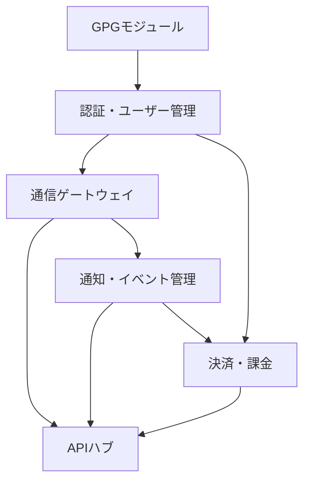

# Libral Core ゼロベース開発戦略 & ロードマップ

## 1. 開発戦略概要

### 戦略の核心
Python + FastAPIを主軸とした6つのコアモジュールをゼロから開発することで、**旧設計の制約から完全に解放**され、以下の決定的なメリットを実現します：

- **設計思想の純化**: 疎結合・イベント駆動アーキテクチャの徹底実装
- **技術的負債の完全排除**: レガシーコードや設計上の妥協を一切持ち込まない
- **最新技術スタックの最適活用**: FastAPI、Pydantic、SQLAlchemy 2.0、async/awaitの完全活用
- **プライバシーファースト設計**: GPG暗号化とTelegramログ記録の設計時点からの統合
- **開発効率の劇的向上**: 明確な責任分界と標準化されたAPIインターフェース

### 技術スタック厳守事項
- **Backend Framework**: FastAPI (Python 3.11+)
- **Database**: PostgreSQL 15+ + SQLAlchemy 2.0
- **Cache/Message Queue**: Redis 7+
- **Container**: Docker + Docker Compose
- **通信プロトコル**: HTTP/2, WebSocket, gRPC
- **暗号化**: GPG (python-gnupg), Cryptography
- **設計パターン**: 疎結合、イベント駆動、CQRS、Repository Pattern

## 2. コアモジュール開発ロードマップ

### Phase 1: 基盤インフラモジュール（1-2週目）

#### 1. GPGモジュール（最優先 - Week 1）
**開発理由**: 全モジュールのセキュリティ基盤として機能

```python
# 主要機能
- .env.gpg 暗号化/復号化
- データベース暗号化（フィールドレベル）
- モジュール間通信の暗号化
- Telegram Bot認証トークンの安全管理
- Context-Lock署名実装
```

**技術仕様**:
- SEIPDv2 + AES-256-OCB
- OpenPGP v6キー対応
- WKD (Web Key Directory) サポート
- HSM/スマートカード対応準備

#### 2. 認証・ユーザー管理モジュール（Week 2）
**開発理由**: GPGモジュールに依存、他の全モジュールが認証に依存

```python
# 主要機能
- Telegram OAuth 2.0統合
- JWT + Refresh Token管理
- ユーザー権限管理（RBAC）
- セッション管理（Redis）
- 個人ログサーバー（Telegramグループ）紐づけ
```

### Phase 2: 通信基盤モジュール（3-4週目）

#### 3. 通信ゲートウェイ・ルーティングモジュール（Week 3）
**開発理由**: 認証モジュールに依存、通知・決済モジュールが依存

```python
# 主要機能
- API Gateway機能（認証・認可・レート制限）
- Telegram Bot Webhook管理
- マルチテナント対応ルーティング
- Circuit Breaker実装
- メッセージキュー統合（Redis Streams）
```

#### 4. 通知・イベント管理モジュール（Week 4）
**開発理由**: 通信ゲートウェイに依存、決済・APIハブが依存

```python
# 主要機能
- イベントソーシング実装
- Telegram通知配信エンジン
- ユーザー個人ログサーバーへの記録プロトコル
- リアルタイム通知（WebSocket）
- イベント履歴・監査ログ
```

### Phase 3: ビジネスロジックモジュール（5-6週目）

#### 5. 決済・課金モジュール（Week 5）
**開発理由**: 通知モジュールに依存（決済通知のため）

```python
# 主要機能
- Telegram Stars決済統合
- サブスクリプション管理
- 取引手数料計算
- 収益分配システム
- 決済履歴暗号化保存
```

#### 6. モジュール間連携・APIハブ（Week 6）
**開発理由**: 全モジュールの統合層として最後に実装

```python
# 主要機能
- サービスディスカバリー
- ロードバランシング
- API統合インターフェース
- モジュール間イベントバス
- システム監視・メトリクス収集
```

## 3. 開発順序の依存関係図



### 依存関係の詳細説明

1. **GPG → 認証**: 認証トークンとユーザー情報の暗号化に必須
2. **認証 → 通信GW**: API認証・認可機能に必須
3. **通信GW → 通知**: Bot Webhook受信とメッセージ配信に必須
4. **通知 → 決済**: 決済完了通知に必須
5. **認証 → 決済**: ユーザー認証と課金情報管理に必須
6. **全モジュール → APIハブ**: 統合インターフェースとして最後に実装

## 4. Libral（AIエージェント）App初期連携戦略

### 最小接続プロトコル

#### 初期連携ステップ（Week 7-8）
1. **認証連携**
   ```python
   # Libral App → 認証モジュール
   POST /api/auth/telegram/verify
   # Telegram User ID検証とJWT発行
   ```

2. **個人ログサーバー初期設定**
   ```python
   # ユーザー専用Telegramグループ作成・Bot追加ウィザード
   POST /api/user/log-server/setup
   # GPG暗号化された設定情報をユーザーグループに記録
   ```

3. **AI対話ログ記録プロトコル**
   ```python
   # 対話ログをユーザー個人グループに暗号化送信
   POST /api/logging/conversation
   # データ: GPG暗号化 + 24時間後自動削除設定
   ```

### 技術的実装詳細

#### Telegram個人ログサーバー統合
```python
class PersonalLogServer:
    async def setup_user_group(self, user_id: int):
        """ユーザー専用ログ記録グループの初期化"""
        # 1. Telegramスーパーグループ作成指示
        # 2. Bot招待リンク生成
        # 3. グループID↔ユーザーID紐づけ（暗号化保存）
        
    async def log_to_personal_server(self, user_id: int, data: dict):
        """個人サーバーへの暗号化ログ記録"""
        # 1. GPGで暗号化
        # 2. ユーザーのTelegramグループに送信
        # 3. 中央サーバーには一切保存しない
```

## 5. 開発における重要な注意点

### 設計思想の厳守
1. **疎結合アーキテクチャ**: モジュール間の直接依存を排除、イベントバス経由の通信
2. **イベント駆動設計**: 全ての状態変更はイベントとして発行・処理
3. **データ主権**: ユーザーデータは必ずユーザー所有サーバー（Telegramグループ）に記録

### プライバシーファースト実装
```python
# 絶対禁止事項
❌ 個人情報の中央集約保存
❌ 平文での機密情報保存
❌ ログ記録の永続化（24時間超）

# 必須実装事項
✅ GPG暗号化の全面適用
✅ Telegram個人グループログ記録
✅ 一時キャッシュの自動削除
✅ .env.gpg による設定管理
```

### パフォーマンス目標
- **API応答時間**: 95%ile < 1秒
- **スタンプ生成**: < 5秒
- **同時接続**: 10,000+ WebSocket connections
- **スループット**: 1,000+ requests/second

## 6. 実装開始準備

### 開発環境セットアップ
```bash
# 1. Python 3.11+ + Poetry環境構築
# 2. PostgreSQL 15 + Redis 7 Docker環境
# 3. GPG鍵ペア生成・管理
# 4. Telegram Bot API設定
# 5. Hetznerサーバー準備
```

### 初期リポジトリ構造
```
libral-core/
├── modules/
│   ├── gpg/          # GPGモジュール
│   ├── auth/         # 認証・ユーザー管理
│   ├── gateway/      # 通信ゲートウェイ
│   ├── events/       # 通知・イベント管理
│   ├── payments/     # 決済・課金
│   └── hub/          # APIハブ
├── shared/           # 共通ライブラリ
├── tests/            # テストスイート
└── deployment/       # Docker・K8s設定
```

この戦略に従い、**6週間でLibral Coreの完全再構築**を実現し、真のプライバシーファーストプラットフォームを構築します。